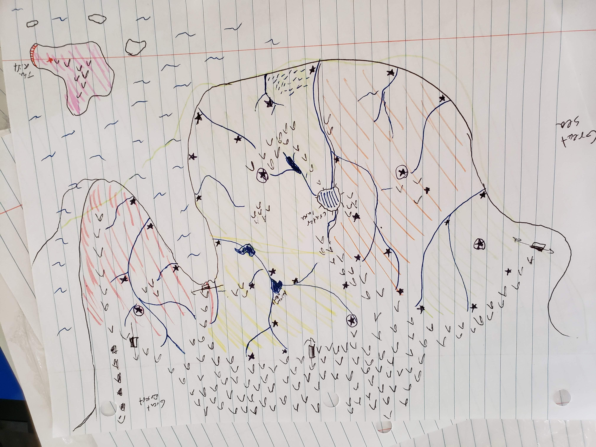

# Last Days of Eden
*A Pen and Paper Adventure*

Othos - red  
Slaver, extreme free capital, sailors, make for decent bad guys (modeled after british east india company, but on steroids)

Adria - green  
The free states, modeled after Germany, has elections for emperor, many small princes

Hallgerd - yellow  
Mountain folk, modeled after the scandinavian nations a little bit, vikings with a bit of supernatural

Foix - orange (pronounced fwa)  
Modeled after medieval france, most familiar, wars with Adria a lot

Isolde - top left green  
Modeleved after ancient celtic culture, with magic, druids and trees

Toward the north west, there is the "evergreen forest" where elves live (after you cross through the mountain pass). Toward the north, there a high platoe, followed by even taller mountains. The Hallgerd say Giants live in those parts. Toward the northeast, there is a large desert that few have been able to cross. By sea, the winds become strong enough that ships are enable to cross.  

The island to the south is the island of `Nendos`, known as the island of wizards. On the very east side of the island there is a portal that leads to the demon world, and not far from the portal is the academy of magic. 

### Concept

This is the remnant of a highly advanced civilization. The civilization found its demise some time in the past, but most of the current inhabitants are unaware of that. How that ancient civilization met its end is unclear at the moment. There are however a few places in the world that do have a memory of the events of the past. The mages of `Nendos` are one of them. They have established a religion over the five kingdoms in an effort to unite them (although doesn't seem to be working). Ultimately they control what they call the "Magus" which they claim, gives them their magical powers. However, the Magus itself is a super human AI, which sits at the core of the magic academy. The AI itself can interface to a very limited degree with the nano-sphere, and has deep knowledge of the past. It is unclear whether the AI was responsible for destroying humanity. 

 There are strange artifacts all across the world, remnants of the former civilization. The mages of Nendos aim to gather them and use them to repair the AI of the Magus. The opponents they most fear are the shadowless. The shadow born use "dark" magic that allows them to exist on a plane that is entirely psychological. They can travel the dreams of people and communicate with one another entirely telepathically. Moreover, the greatest among them are thought to be able to exist entirely within the plain of thought, once they die. What bothers the wizards of Nendos is that the shadowless are essentially impossible to control and do seem to have their own magic (via the nano sphere). The shadowless are very suspicious of the Magus and their more militant factions do want to destroy it. It is unclear whether the shadowless are responsible for the fall of civilization. 
 
 The "reborn" are a bit like zombies. Before the fall of civilization, Rhadamanthus being a fantastic biotech engineer, was able to save himself by interfacing directly with the nano sphere and powering his body over the millennia. He has secretly been building an army of zombies by raising the dead, with a goal of fighting off and destroying Magus. Unfortunately, most of the people he "revives" are very heavily damaged and unable to function as more than basic labor or conscript. Some however, voluntarily joined him before their deaths. These are the "undying". They no longer age (although their body is visibly blue) and serve as Rhadamanthus' generals. It seems that over the ages, the technology necessary for the maintenance of eternal life was damaged somehow. Every year, Rhadamanthus and his followers become more and more zombie like as the regeneration process is unable to complete fully. Rhadamanthus aims to find a way to repair the technology, but the five kingdoms tend to destroy his plans every time they find him. As such, Rhadamanthus has it in his mind to make everyone immortal and finally face against Magus. It is unclear whether Rhadamanthus was responsible or a contributing factor in any way for the fall.  
 
 The Aleesians are a the fabled elves and can sometimes be found in the north west of Isolde. They are a group of Amazonian looking women (only women) with slightly longer ears. Sometime around the fall, a civilization developed of genetically engineered super humans who were all female. They live a long time (hundreds of years) and have a vague recollection of the world that preceded this one, but have no desire to return to it. The world before the fall was a technological one, and they consider technology to be a corrupting influence. Instead, they live and maintain the beauty of the ever green forest, where they hunt and generally live out their lives in contemplation of nature.    
 
 
